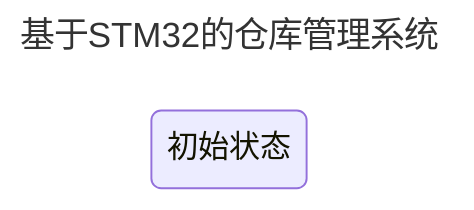
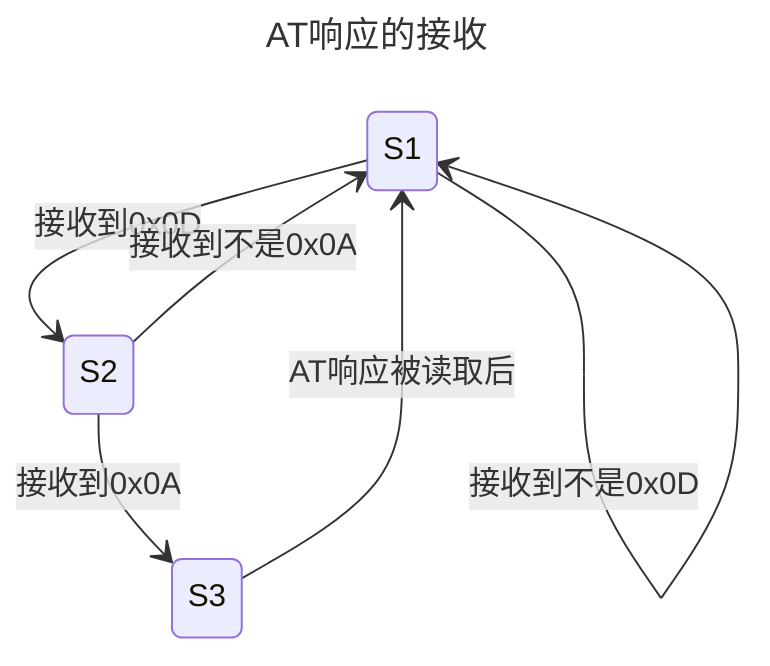
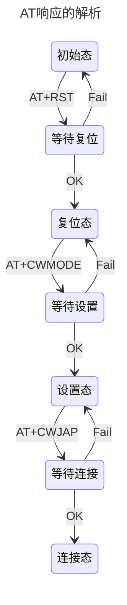

```mermaid
---
title: 基于STM32的仓库管理系统
---
stateDiagram-v2
    init: 初始状态
    

```

```mermaid
---
title: AT响应的接收
---
stateDiagram-v2
	S1 --> S2: 接收到0x0D
	S2 --> S3: 接收到0x0A
	S1 --> S1: 接收到不是0x0D
    S2 --> S1: 接收到不是0x0A
    S3 --> S1: AT响应被读取后
```

```mermaid
---
title: AT响应的解析
---
stateDiagram-v2
	initial	 : 初始态
	reset	 : 复位态
	setMode	 : 设置态
	connect	 : 连接态
	waitRst	 : 等待复位
	waitMode : 等待设置
	waitConn : 等待连接
	
	initial 	-->		waitRst		: AT+RST
	waitRst 	--> 	reset		: OK
	waitRst 	--> 	initial 	: Fail
	reset		--> 	waitMode	: AT+CWMODE
	waitMode	--> 	setMode		: OK
	waitMode	--> 	reset		: Fail
	setMode 	--> 	waitConn	: AT+CWJAP
	waitConn	-->		connect		: OK
	waitConn	--> 	setMode		: Fail
	
```

